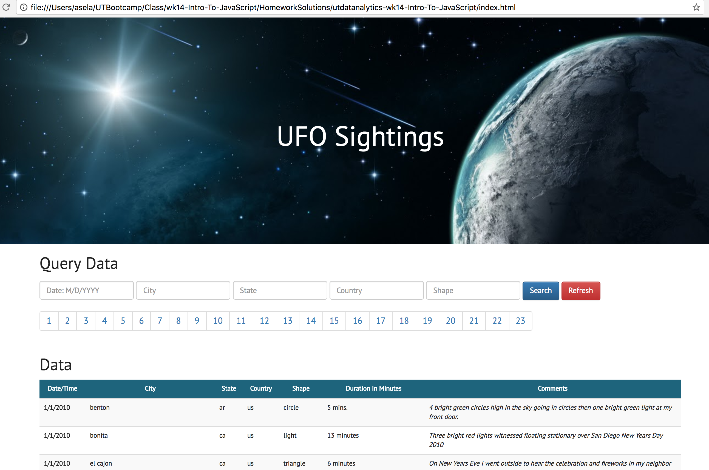

# We May Not Be Alone

We May Not be a Alone is a client-side Javascript application which explores a dataset on UFO sigthtings. It comes with a query form which can handle multiple queries in order for data drilling. In addition, the applications also has a Parallax Scrolling Effect to make it aesthetically pleasing. Enjoy!

#### Technology stack used in developing this web application is as follows:
* JavaScript
* HTML
* CSS
* Bootstrap

#### Images from the final app

#### Todo
Add previous and next table on the pagination